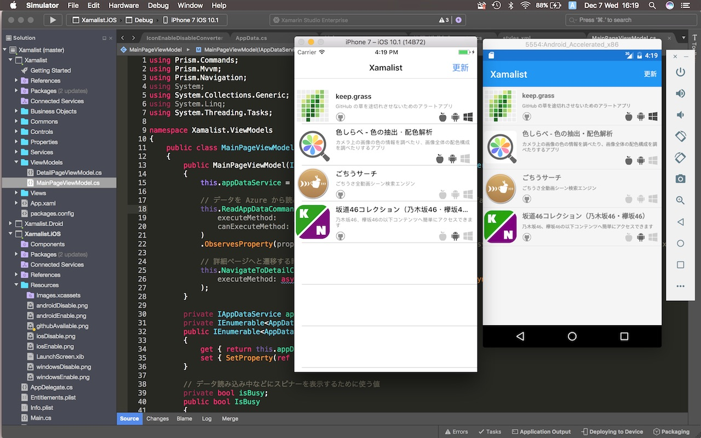
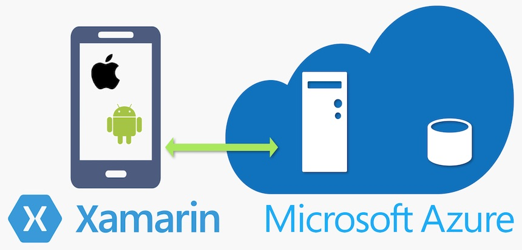

# Xamalist (ざまりすと)

「Xamarin 製アプリ一覧アプリ」です。 

よく「Xamarinを使ったらどんなアプリが作れるの？」など聞かれるので、欲しいと思ったので作りました！



C# だけで、iOS/ Android アプリを作っています。Swift/Obj-C も Java も 1行も書いていません。    
UIは XAML(ザムル)というマークアップ言語を使っています。    
コードは今のところ iOS/Android間で 9.5割くらい共通化しています。    


早く完成させてストアに上げたいなあ

## 使っているもの



### クライアント:

* Xamarin.Forms
* Prism

### サーバサイド:

* Microsoft Azure Mobile Apps

## 始め方

clone したままでは動きません。    
サーバURLを記述した `Xamalist/Commons/Consts.cs` ファイルを gitignore しているので、     
clone したら そのファイルを作ってサーバURLを記述してください。    
(サーバ環境は各自 `Microsoft Azure Mobile Apps` を使い用意していただく必要があります。DBのスキーマなどは `Xamalist/BusinessObjects/`下のクラスを参照してください)

````csharp
using System;
namespace Xamalist
{
    // 外部に公開したくない文字列などの設定ファイル
    public static class Consts
    {
        // 接続先の Webサーバのアドレス
        public static readonly string AzureWebsitesUrl = "https://(サーバーのURL文字列).azurewebsites.net";

        // Azure 上のストレージの接続文字列
        public static readonly string StorageConnectionString = "めっちゃ長い接続文字列。Azureのポータルの「アクセスキー」から取って来てね";
        // 参照:『Microsoft Azure Storage の概要』 https://docs.microsoft.com/azure/storage/storage-introduction?WT.mc_id=dotnet-0000-machiy
    }
}
````

This software is released under the MIT License, see LICENSE.txt.
